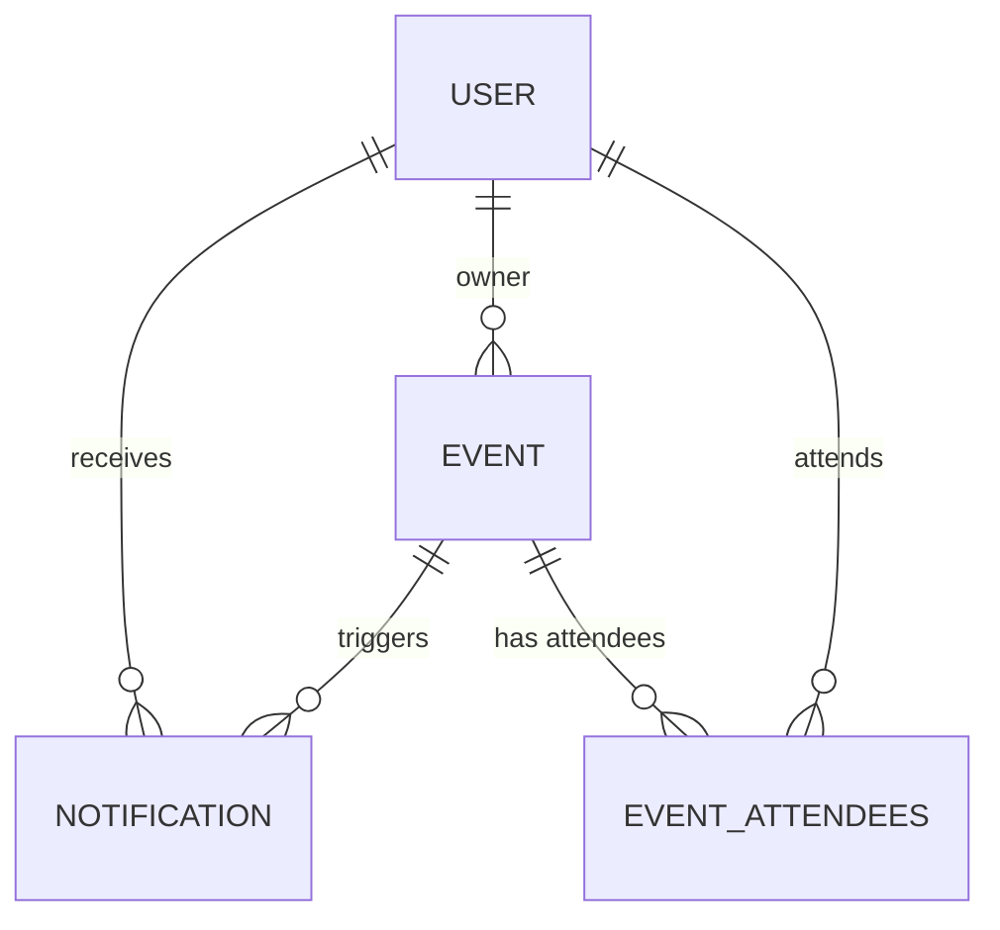

# Osobní kalendář (udalosti, notifikace, sdilení)

## Funkční požadavky
- Uživatelé se mohou registrovat a přihlašovat.
- Uživatelé mohou dělat CRUD operace.
- Události mohou být sdílené s ostatními uživateli.
- Podpora pro opakující se události.
- Uživatelé mohou přijímat/odmítnout pozvánky na události.
- Notifikace pro připomenutí událostí a pozvánek.
- Možnost nastavit status události: potvrzeno, tentativní, zrušeno.

## Objekty
- Event
- User
- Notification
- Event attendees

## Diagram



## SQL tables

```sql
CREATE TABLE events (
    id INT AUTO_INCREMENT PRIMARY KEY,
    title VARCHAR(255) NOT NULL,
    description TEXT,
    start_time DATETIME NOT NULL,
    end_time DATETIME NOT NULL,
    all_day BOOLEAN DEFAULT FALSE,
    location VARCHAR(255),
    is_recurring BOOLEAN DEFAULT FALSE,
    recurrence_rule VARCHAR(255),
    recurrence_end DATE,
    owner_id INT NOT NULL,
    visibility ENUM('private', 'public', 'shared') DEFAULT 'private',
    reminder_time DATETIME,
    color VARCHAR(7),
    status ENUM('confirmed', 'tentative', 'cancelled') DEFAULT 'confirmed',
    created_at DATETIME DEFAULT CURRENT_TIMESTAMP,
    updated_at DATETIME DEFAULT CURRENT_TIMESTAMP ON UPDATE CURRENT_TIMESTAMP,
    FOREIGN KEY (owner_id) REFERENCES users(id)
);

CREATE TABLE event_attendees (
    event_id INT NOT NULL,
    user_id INT NOT NULL,
    status ENUM('accepted', 'declined', 'tentative', 'invited') DEFAULT 'invited',
    role ENUM('owner', 'participant') DEFAULT 'participant',
    PRIMARY KEY (event_id, user_id),
    FOREIGN KEY (event_id) REFERENCES events(id) ON DELETE CASCADE,
    FOREIGN KEY (user_id) REFERENCES users(id) ON DELETE CASCADE
);

CREATE TABLE users (
    id INT AUTO_INCREMENT PRIMARY KEY,
    username VARCHAR(50) NOT NULL UNIQUE,
    email VARCHAR(100) NOT NULL UNIQUE,
    password_hash VARCHAR(255) NOT NULL,
    full_name VARCHAR(100),
    created_at DATETIME DEFAULT CURRENT_TIMESTAMP,
    updated_at DATETIME DEFAULT CURRENT_TIMESTAMP ON UPDATE CURRENT_TIMESTAMP
);

CREATE TABLE notifications (
    id INT AUTO_INCREMENT PRIMARY KEY,
    user_id INT NOT NULL,
    event_id INT, -- optional if notification is event-related
    type ENUM('event_invite', 'event_update', 'reminder', 'custom') NOT NULL,
    message TEXT NOT NULL,
    is_read BOOLEAN DEFAULT FALSE,
    notify_at DATETIME,
    created_at DATETIME DEFAULT CURRENT_TIMESTAMP,
    updated_at DATETIME DEFAULT CURRENT_TIMESTAMP ON UPDATE CURRENT_TIMESTAMP,
    FOREIGN KEY (user_id) REFERENCES users(id) ON DELETE CASCADE,
    FOREIGN KEY (event_id) REFERENCES events(id) ON DELETE CASCADE
);
```